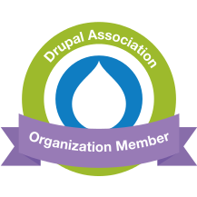

---
seo:
    type: Corporation
    links:
        - https://www.drupal.org/fabb
---

We are a team of two developers with a focus on creating effective modern web solutions, and experience building sites
and services across a variety of sectors for both commercial and not-for-profit organisations, including Imperial War
Museums, the Care Quality Commission, Nestlé and TES Global.

## Services

- Needs analysis and solution design
- Rapid prototyping
- Full site implementation
- Site audit
- Site customisations
- Migrations
- Integrations with external services
- Responsive and accessible frontend development

## Technology

> Everything should be as simple as it can be, but not simpler

We aim for simple and maintainable solutions that fit your audience and budget.

### Backend

We focus on the Drupal 8 open source content management framework as the toolkit to build the backbone of your site,
with its wealth of third party modules, mature release and security process, and powerful new features being released
every 6 months. With over 17 years of combined Drupal experience between us, we're active members of the community that
works hard to ensure that the pieces which make up your site are embraced, tested and improved.

### Frontend

We will convert your responsive designs into beautiful, pixel perfect and functional frontend solutions which work
across the wide variety of devices common on today's web. With a focus on accessibility and standards, and with Drupal
powering the backend, you can trust your site will work just as well with the new browsers of tomorrow.

### Why Drupal?

- It’s a proven open source technology, powering websites for CARE, The Economist and London Gatwick, currently on its
  eighth and most ambitious version yet.
- The core provides a powerful set of tools with which you can build complex data models, rich authoring experiences,
  customised workflows, REST services and much more.
- It has a mature security process whereby security bugs are fixed in private and then announced with their fix in a
  controlled and public manner.
- It has an active community that use, maintain, support and develop Drupal daily, as well as the support of companies
  and corporations across a diverse range of sectors.
- It has a sophisticated automated testing infrastructure, covering not just the core software but contributed modules…
  including those we build for you.

### Why Open Source?

- Avoid vendor lock-in: get support from a wide range of sources.
- Benefit from a large community of developers and testers.
- Take as much of the development as you like in-house.

### Operations

Technology should work for you - not the other way around!

- We use **automated testing** to verify your features deliver the expected functionality; we particularly like to use
  Behat tests, which allow us to use simple English sentences to describe how things should work - and then verifies the
  actual site matches the expected behaviour.
- We use **continuous integration** to automatically run tests regularly, reassuring you that your site works on
  delivery, and will continue to work as it evolves.
- We believe in **infrastructure as code**. Our development environment is set up to match production environments as
  closely as possible, ideally with the configuration being stored within the codebase. This ensures when we’re
  developing we see exactly the same behaviour as you and your customers.
- We **protect personal data** of you and your customers. We have a clear and documented process to ensure that any
  personal data is cleansed before it reaches a development laptop.
- We consider the development environment part of the product: we provide a **“one-click” deployment process** that sets
  up a safe and functional development environment, making it easy for you to either do development in-house, or
  outsource to another company.

## Get in touch

If any of this sounds interesting to you, or if you'd just like to talk about your needs, please get in touch with us.

 
 
- Email: <info@fabbdev.com> or use the form provided below
- Call us on:
  - +44&nbsp;(0)7367&nbsp;440&nbsp;337
  - +44&nbsp;(0)7367&nbsp;442&nbsp;136
- [Visit our Drupal.org profile](https://www.drupal.org/fabb)
